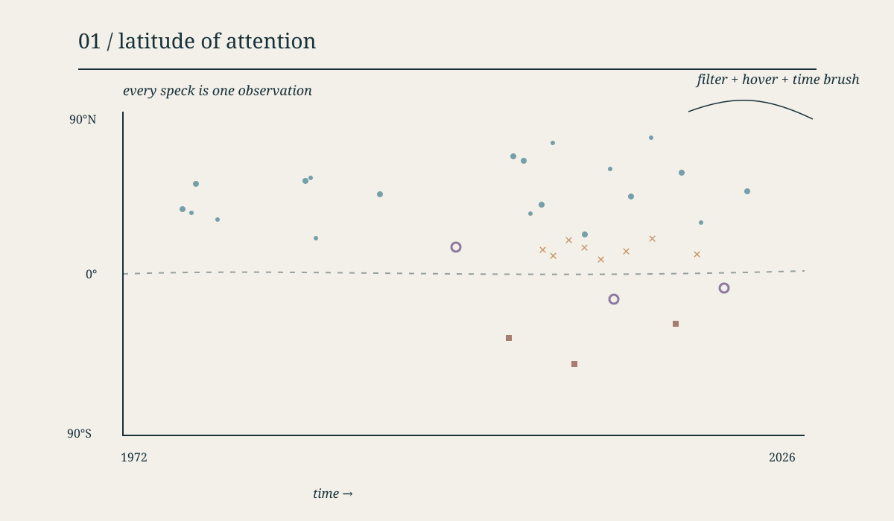
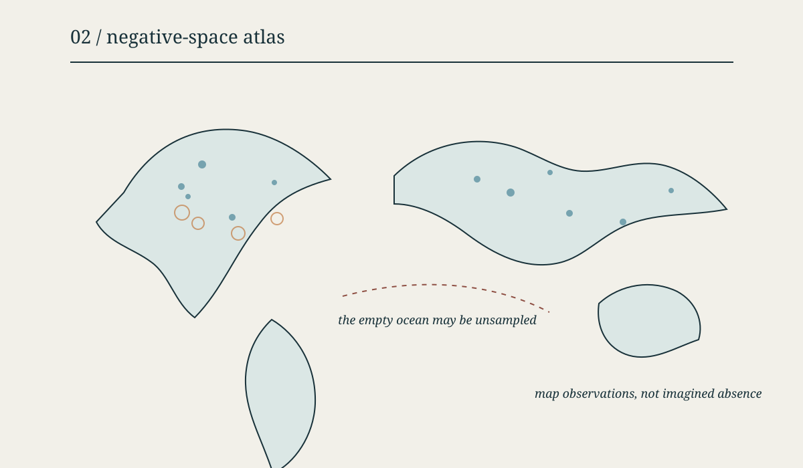
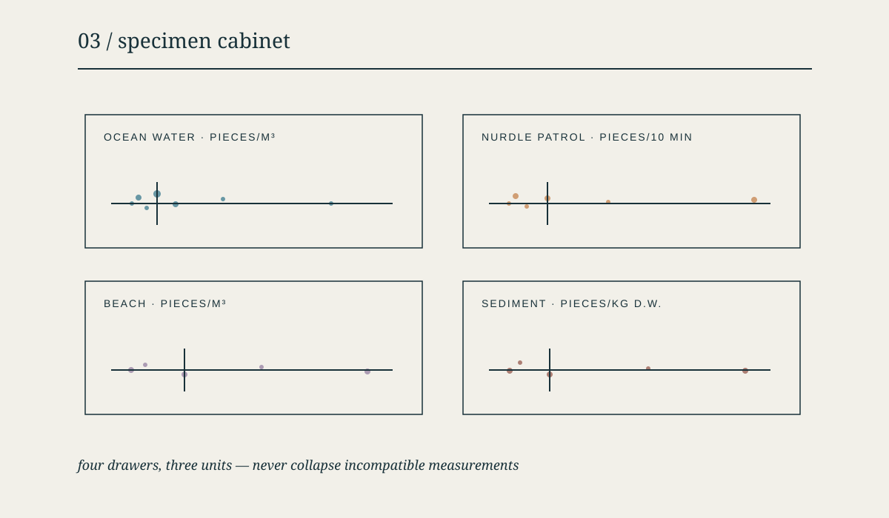

# The Ocean Remembers Where We Looked

An interactive D3 study of **29,076 marine microplastics observations**, organized by the date and latitude at which each record was collected.

**Live page:** [https://mere0125.github.io/microplastics-atlas/](https://mere0125.github.io/microplastics-atlas/)

**Author:** Mere Cui

**Course:** Data Visualization for Architecture, Urbanism, Humanity — Fall 2026

**Final submission review:** October 10, 2026

The final chart is deliberately an atlas of **sampling attention**, not a pollution ranking. NOAA identifies the source as a presence-only database: a blank area may be unobserved rather than free of microplastics.

## Step 2 — Dataset documentation

| Item | Description |
|---|---|
| Dataset name | *The NOAA NCEI Global Marine Microplastics Harmonized Database during 1972-04-20 to Present* (NCEI Accession 0306475) |
| Source / organization | NOAA National Centers for Environmental Information (NCEI) |
| Dataset URL | [https://doi.org/10.25921/v8gj-k896](https://doi.org/10.25921/v8gj-k896) |
| Interactive data portal | [NOAA Marine Microplastics Map](https://marinemicroplastics-noaa.hub.arcgis.com/pages/web-map) |
| Date accessed | October 9, 2026 |
| Brief description | A harmonized, presence-only collection of observed microplastic concentrations in ocean water, beach samples, ocean sediment, and Nurdle Patrol surveys. Records include time, coordinates, sampling details, concentration class, measurement, unit, and source reference. |
| Time period in this snapshot | April 20, 1972–April 28, 2026 |
| Geographic coverage | Global marine environments; approximately 71.70°S–89°N and 179.99°W–179.85°E |
| Original dimensions | 29,076 rows × 34 columns in the live ArcGIS feature layer at access time |
| Repository file | 29,076 rows × 14 selected and renamed columns in [`data/microplastics.csv`](data/microplastics.csv) |
| Available formats | ArcGIS Feature Service; NOAA also provides CSV, JSON, and GeoJSON export options |
| License / terms | [CC0 1.0 Public Domain Dedication](https://creativecommons.org/publicdomain/zero/1.0/), with NOAA’s standard distribution disclaimer |

### Unit of observation

Each row represents one reported microplastics observation at a particular location and time. The repository copy preserves every row in the source snapshot but retains only the 14 fields needed for this project.

### Citation

Nyadjro, Ebenezer; Webster, Jennifer; Boyer, Tim; Cebrian, Just; Collazo, Leonard; Kaltenberger, Gunnar; Larsen, Kirsten; Lau, Yee; Mickle, Paul; Toft, Tiffany; Wang, Zhankun (2025). *The NOAA NCEI Global Marine Microplastics Harmonized Database during 1972-04-20 to Present* (NCEI Accession 0306475), full database snapshot accessed 2026-10-09. NOAA National Centers for Environmental Information. [https://doi.org/10.25921/v8gj-k896](https://doi.org/10.25921/v8gj-k896).

## Step 3 — Data exploration

### Important variables

| Type | Variables | Use in this project |
|---|---|---|
| Numerical | `latitude`, `longitude`, `measurement` | Position and reported quantity |
| Categorical | `medium`, `sampling_method`, `unit`, `concentration_class` | Filtering, symbols, and interpretation |
| Temporal | `date`, `year` | Horizontal position and time-range interaction |
| Geographic | `latitude`, `longitude`, `ocean`, `region`, `country` | Spatial coverage and tooltip context |
| Provenance | `reference`, `id` | Source attribution and record identity |

The variables I find most useful are `date`, `latitude`, and `medium`. Together, they reveal how the geographic reach and composition of the archive changed, without pretending that unequal sampling represents the true distribution of pollution.

### Basic counts

| Marine setting | Records | Share | Years represented | Unit |
|---|---:|---:|---:|---|
| Ocean water | 16,988 | 58.4% | 1972–2024 | pieces/m³ |
| Nurdle Patrol | 10,615 | 36.5% | 2018–2026 | pieces/10 min |
| Beach | 893 | 3.1% | 2015–2023 | pieces/m³ |
| Ocean sediment | 580 | 2.0% | 2017–2022 | pieces/kg dry weight |
| **Total** | **29,076** | **100%** | **1972–2026** | Three different units |

Of all records, **27,374 (94.1%) are north of the equator**, 1,697 are south, and five are recorded at 0° latitude. This is a major geographic imbalance in the observation archive, not evidence that the Northern Hemisphere contains 94.1% of marine microplastics.

The most common concentration class is **Medium** (13,498 records), followed by Very Low (7,243), High (4,067), Low (3,177), and Very High (1,091). The most frequently represented year is **2019**, with 2,911 observations.

### Descriptive statistics by unit

Measurements with different units are not combined. Means are included because the assignment requests descriptive statistics, but the medians are more representative because all three distributions are extremely right-skewed.

| Unit | n | Minimum | Maximum | Mean | Median |
|---|---:|---:|---:|---:|---:|
| pieces/m³ | 17,881 | 0 | 800,000 | 473.986 | 0.01296 |
| pieces/10 min | 10,615 | 0 | 328,445 | 160.811 | 10 |
| pieces/kg dry weight | 580 | 0 | 40,510 | 355.802 | 52.727 |

The very large gaps between mean and median indicate long-tailed distributions and extreme observations. The `pieces/m³` category also includes both ocean-water and beach records, so even equal units do not guarantee equal collection methods or directly comparable samples.

### Missing and unusual values

| Variable | Missing | Share |
|---|---:|---:|
| `country` | 17,392 | 59.8% |
| `region` | 15,767 | 54.2% |
| `ocean` | 1,389 | 4.8% |
| date, latitude, longitude, medium, unit, class, method | 0 | 0% |

In NOAA’s original schema, `Microplastics_measurement` is blank for all 10,615 Nurdle Patrol records because their values are stored separately in `Standardized_Nurdle__Amount`. The preparation script combines those two mutually exclusive source fields into one `measurement` column while preserving `unit`. The derived file therefore has no missing measurements.

There are **no duplicate non-empty IDs** and **no exact duplicate rows** in the 14-column derived file.

### Problems and limitations

1. **Presence-only data.** No record means “not observed or not contributed,” not “no microplastics.”
2. **Uneven sampling.** The archive is strongly concentrated in the Northern Hemisphere, Atlantic Ocean, and recent years.
3. **Incompatible units.** Ocean water/beach, sediment, and Nurdle Patrol measurements use three different units and cannot be placed on one quantitative scale.
4. **Method variation.** The snapshot contains 39 sampling-method labels. Mesh size, equipment, laboratory procedures, and sampling effort vary across source studies.
5. **Extreme skew.** A small number of very large measurements pull means far above medians.
6. **Changing composition.** Nurdle Patrol records begin in 2018 and substantially change the mix of later observations. A rise in record counts is not automatically a rise in pollution.
7. **Sparse place labels.** More than half of records have no region or country, although all records have coordinates.

## Step 4 — Questions

1. **How has the latitude and volume of marine microplastics sampling changed from 1972 to 2026?**
2. **Which parts of the world and which marine settings receive the most observational attention—and where are the largest gaps?**
3. **How did the archive change after Nurdle Patrol observations began in 2018?**
4. How do concentration distributions differ among settings when only records with compatible units and collection methods are compared?
5. Which sampling methods are associated with the widest geographic coverage?

## Step 5 — Three proposed uses

### 1. Latitude of attention — selected and built



**What it shows:** Each observation positioned by date and exact latitude, with symbol and color indicating the marine setting.  
**Audience:** Students, educators, environmental researchers, and readers interested in how scientific evidence is assembled.  
**Why it matters:** It makes temporal and hemispheric sampling bias visible without confusing observation density with pollution intensity.

### 2. Negative-space atlas



**What it shows:** A projected world map of records, designed to foreground unsampled or sparsely sampled ocean areas.  
**Audience:** Research planners and environmental organizations deciding where more monitoring may be useful.  
**Why it matters:** It treats gaps in knowledge as part of the story. It would need careful language because “empty” cannot be interpreted as “clean.”

### 3. Specimen cabinet



**What it shows:** Separate distribution panels for compatible marine settings and units, using a logarithmic scale and medians rather than combining unlike measurements.  
**Audience:** Readers who want to compare the shape and range of reported concentrations.  
**Why it matters:** It reveals skew and outliers while keeping incompatible units visibly separate.

## Step 6 — Final chart

The implemented chart, **“Latitude of attention,”** uses all 29,076 records. Its horizontal axis is sample date and its vertical axis is recorded latitude. Each setting has both a distinct color and mark shape, so the categories do not depend on color alone.

Interactions include:

- entering the project through an animated ocean-surface scene;
- a looping layer of real ocean footage stored locally in the repository, so the scene does not depend on an external website;
- a hand-drawn shell cursor that leaves responsive water ripples and subtly disturbs the background wave field;
- filtering among all records, ocean water, Nurdle Patrol, beach, and ocean sediment;
- brushing the small timeline to select a year range;
- playing an animated accumulation of the archive from 1972 forward;
- hovering to inspect date, coordinates, value and unit, method, concentration class, and source reference;
- keyboard inspection with left and right arrow keys after focusing the chart.

The chart intentionally does **not** encode measurement as size or color. Doing so across this full dataset would make incompatible units and sampling methods look comparable.

## Files

```text
.
├── index.html
├── styles.css
├── script.js
├── README.md
├── assets/
│   ├── sketch-01-latitude-of-attention.svg
│   ├── sketch-02-negative-space-atlas.svg
│   ├── sketch-03-specimen-cabinet.svg
│   └── ocean-surface.webm
├── data/
│   ├── microplastics.csv
│   └── profile.json
├── scripts/
│   └── fetch_and_profile.py
└── vendor/
    └── d3.v7.min.js
```

## Run locally

Because browsers restrict local CSV requests, open the project through a small local server:

```bash
python3 -m http.server 8000
```

Then visit [http://localhost:8000](http://localhost:8000).

To refresh the dataset from NOAA’s live ArcGIS layer and regenerate the profile:

```bash
python3 scripts/fetch_and_profile.py
```

The refresh script requires Python 3 and the `certifi` package. Because NOAA updates the database, a future refresh may produce different row counts, date ranges, and summary statistics from this October 9, 2026 snapshot.

## Data preparation

The preparation script:

1. queries NOAA’s public ArcGIS Feature Service in pages of 1,000 records;
2. checks that the downloaded row count matches the service count;
3. sorts requests by ArcGIS Object ID for stable pagination;
4. selects and renames 14 fields used in the project;
5. combines the standard measurement field with the separate standardized Nurdle amount while retaining the original unit;
6. writes the reproducible CSV and a machine-readable quality profile.

No synthetic or imputed observations are used.

## Media credit

The locally hosted background footage is the 480p Wikimedia transcode of [*Waves of the sea (Video)*](https://commons.wikimedia.org/wiki/File:Waves_of_the_sea_(Video).webm) by Amada44, licensed under [CC BY-SA 4.0](https://creativecommons.org/licenses/by-sa/4.0/). The video file itself is unmodified; it is cropped and color-treated at display time with CSS. The animated wave field, pointer ripples, shell cursor, layout, and data marks are original code created for this project.
